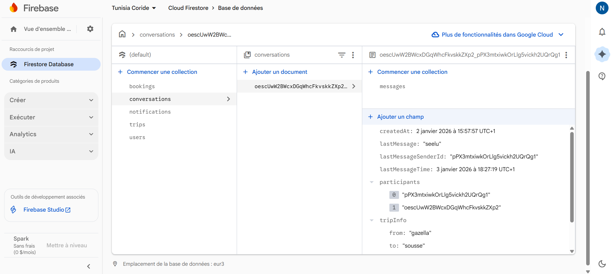

Description du projet et ses fonctionnalités:
Tunisia CoRide est une application mobile Flutter dédiée au covoiturage. Elle propose une interface utilisateur moderne et s'appuie sur Firebase pour les services backend (authentification, base de données en temps réel / Cloud Firestore, stockage, notifications). L'objectif principal est de permettre à des usagers de proposer et réserver des trajets de manière simple et sécurisée.

Cas d'usage principaux
- Un conducteur publie une annonce de trajet (origine, destination, date/heure, places disponibles, prix).
- Un passager recherche des trajets disponibles en fonction de son origine/destination et date.
- Un passager réserve une place et reçoit une confirmation.
- Les utilisateurs s'authentifient (email/password) et peuvent gérer leur profil (nom, téléphone, photo).
- Notifications push pour confirmations, messages et rappels.
- Suivi basique du trajet (position du conducteur) et messagerie in-app pour coordonner la prise en charge.

Fonctionnalités:
- Authentification et sécurité
  - Inscription / connexion par email et mot de passe via Firebase Authentication.
  - Réinitialisation de mot de passe par email.

- Gestion du profil utilisateur
  - Nom, numéro de téléphone, photo de profil.
  - Historique des trajets réservés et proposés.

- Recherche et découverte de trajets
  - Recherche par ville/coordonnées, date et filtres (prix, places disponibles).
  - Liste des trajets avec détails et coordonnées du conducteur.

- Publication d'une annonce (cas du conducteur)
  - Formulaire simple : origine, destination, date/heure, nombre de places, prix, description.
  - Possibilité d'éditer ou d'annuler une annonce.

- Réservation et gestion des places
  - Réservation d'un ou plusieurs sièges.
  - Gestion des demandes (acceptation/rejet par le conducteur).

- Messagerie et notifications
  - Messagerie in-app pour communiquer entre passager et conducteur.
  - Notifications push (Firebase Cloud Messaging) pour alertes importantes.

- Localisation et suivi
  - Affichage de la position approximative du conducteur (optionnel selon permissions).

- Évaluations et commentaires (optionnel)
  - Système de notation et retour d'expérience après trajet.

Architecture technique:
- Frontend : Flutter (Dart). Code UI dans `lib/` (ex : `main.dart`, `screens/`, `widgets/`).
- Backend : Firebase (Authentication, Cloud Firestore, Storage, Cloud Messaging). Pas de serveur dédié nécessaire.
- Intégrations : Google Maps / Geocoding (pour sélection d'itinéraires et affichage cartographique), éventuellement une solution de paiement si souhaitée.

Modèle de données (exemples simplifiés)
- users/{userId} : { name, email, phone, photoUrl, createdAt }
- rides/{rideId} : { driverId, origin, destination, time, availableSeats, price, createdAt }
- bookings/{bookingId} : { rideId, passengerId, seatsBooked, status }
- messages/{conversationId}/messages : { fromId, toId, text, createdAt }

Comment exécuter le projet:
---------------------------------------
Prérequis : Flutter SDK, Dart, Android SDK (ou Xcode si iOS), Firebase CLI (recommandé pour configurer `firebase_options.dart`).

**Exécuter le frontend (application Flutter) :**
- **1) Installer les dépendances :**
  - Ouvrez un terminal à la racine du projet et lancez :
    flutter pub get

- **2) Lancer l'application :**
  - Sur un émulateur Android ou appareil connecté :

    flutter run -d android

  - Sur iOS (macOS + Xcode) :

    flutter run -d ios

  - Pour le web :

    flutter run -d chrome

  - Pour Windows :

    flutter run -d windows

**Backend / Services (Firebase) :**
- **Architecture :** Ce projet utilise Firebase (Authentication, Cloud Firestore, Storage, Messaging) en tant que backend serverless.
- **Configurer Firebase :**
  1. Créez un projet sur https://console.firebase.google.com.
  2. Activez Authentication (Email/password) et Cloud Firestore (et Storage si nécessaire).
  3. Ajoutez une application Android et/ou iOS dans la console Firebase.
  4. Téléchargez `google-services.json` (Android) et `GoogleService-Info.plist` (iOS) et placez-les dans les dossiers `android/app/` et `ios/Runner/` respectivement.
  5. Installez et utilisez FlutterFire CLI pour générer `lib/firebase_options.dart` :

     dart pub global activate flutterfire_cli
     flutterfire configure

  6. Vérifiez que `lib/firebase_options.dart` existe et que les identifiants Firebase sont corrects.

- **Emulateurs (optionnel) :**
  - Installez Firebase CLI : `npm install -g firebase-tools`
  - Démarrez les émulateurs pour développement local :

    firebase emulators:start --only auth,firestore,storage

  - Note : l'application doit être configurée pour pointer vers les émulateurs.

**Fichiers importants :**
- `lib/main.dart` : point d'entrée de l'application.
- `lib/firebase_options.dart` : configuration Firebase (généré).
- `android/app/google-services.json` et `ios/Runner/GoogleService-Info.plist` : fichiers de configuration Firebase natives.

**Remarques & dépannage :**
- Si vous avez une erreur liée à Firebase, assurez-vous que `firebase_options.dart` correspond bien au projet Firebase actuel.
- Pour des tests locaux, utilisez la Firebase Emulator Suite.

